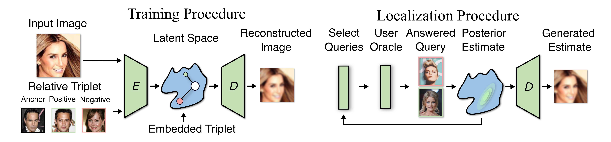

# [Oracle Guided Image Synthesis with Relative Queries](https://openreview.net/forum?id=rNh4AhVdPW5)

This is a repository for my work on the paper ["Oracle Guided Image Synthesis with Relative Queries"](https://openreview.net/forum?id=rNh4AhVdPW5).



Link: https://openreview.net/forum?id=rNh4AhVdPW5

**Code from paper coming soon.**

If you found this paper interesting please cite using the following bibtex:

```bibtex
@inproceedings{
  helbling2022oracle,
  title={Oracle Guided Image Synthesis with Relative Queries},
  author={Alec Helbling and Christopher John Rozell and Matthew O'Shaughnessy and Kion Fallah},
  booktitle={ICLR Workshop on Deep Generative Models for Highly Structured Data},
  year={2022},
  url={https://openreview.net/forum?id=rNh4AhVdPW5}
}
```
