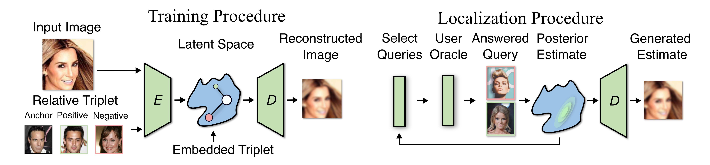

# [Oracle Guided Image Synthesis with Relative Queries](https://arxiv.org/abs/2204.14189)

This is a repository for my work on the paper ["Oracle Guided Image Synthesis with Relative Queries"](https://arxiv.org/abs/2204.14189). 

Paper: https://arxiv.org/abs/2204.14189

OpenReview: https://openreview.net/forum?id=rNh4AhVdPW5



Isolating and controlling specific features in the outputs of generative models in a user-friendly way is a difficult and open-ended problem. We develop techniques that allow a user (oracle) to generate an image they are envisioning in their head by answering a sequence of relative queries of the form **<em>"do you prefer image a or image b?"</em>** Our framework consists of a Conditional VAE that uses the collected relative queries to partition the latent space into preference-relevant features and non-preference-relevant features. We then use the user's responses to relative queries to determine the preference-relevant features that correspond to their envisioned output image. Additionally, we develop techniques for modeling the uncertainty in images' predicted preference-relevant features, allowing our framework to generalize to scenarios in which the relative query training set contains noise.

https://user-images.githubusercontent.com/14181830/165658872-849b34f5-7a78-41a0-8028-a84732980114.mp4


If you found this paper interesting please cite using the following bibtex:

```bibtex
@inproceedings{
  helbling2022oracle,
  title={Oracle Guided Image Synthesis with Relative Queries},
  author={Alec Helbling and Christopher John Rozell and Matthew O'Shaughnessy and Kion Fallah},
  booktitle={ICLR Workshop on Deep Generative Models for Highly Structured Data},
  year={2022},
  url={https://openreview.net/forum?id=rNh4AhVdPW5}
}
```

## Code setup

Create a conda environment from the requirements.txt file. 

```
    conda create --name <env> --file requirements.txt
```

## Run a basic experiment

You can run one of our experiment templates as follows. Each contain a python dictionary, which configures the model, dataset, and experiment. 

1. ```cd auto_localization/experiments/morpho_mnist```
2. ```python bayesian_triplet_experiment.py <run_name>```

## Experiment Analysis

You can analyze these models using the jupyter notebooks in ```auto_localization/experiments/morpho_mnist/experiment_analysis/```.
